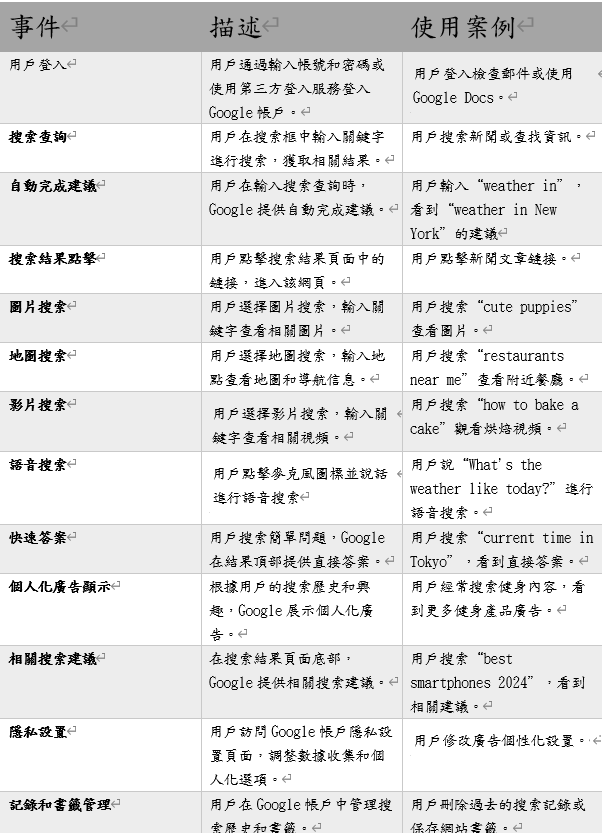
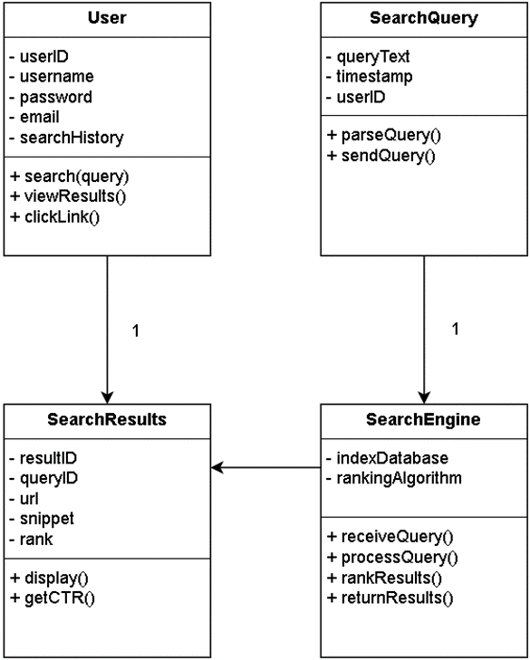

# Google.com 系統分析期末專案
>
>學號：111111214
> 
>姓名：張瀚升
> 
>撰寫時間：240 (mins)
>

### 本份文件包含以下主題：
- [ X ] 選擇動機
- [ X ] google簡介
- [ X ] 製作內容
- [ X ] 心得

## 選擇Google動機

 Google.com作為網路世界資料檢索的主要工具，Google.com 對全球的資料流通、學術研究、商業活動和日常生活都產生了深遠的影響。它不僅改變了人們獲取信息的方式，也推動了網路技術的發展，這也是我選取其作為期末報告的主因。

## Google-簡介
Google.com 是世界上最受歡迎和使用最廣泛的搜索引擎，由Google公司運營。自1998年由Larry Page和Sergey Brin創立以來，Google.com 已經成為網路上訊息檢索的主要入口，幫助全球用戶快速查找所需的資料。其主要功能如下:
搜索功能：
1.	網頁搜索：用戶可以通過關鍵字或語音進行搜索，Google會根據相關性和權威性展示網頁結果。
2.	圖片搜索：提供高質量的圖片檢索功能，用戶可以通過關鍵詞或上傳圖片進行查找。
3.	地圖搜索：提供精確的地理位置和路線導引，包含街景和交通。
4.	學術搜索：針對學術文章、論文和書籍的專業搜索工具。
個性化服務：
1.	Google帳戶整合：允許用戶登錄並訪問個性化的搜索歷史和偏好設定。
2.	Google助手：通過語音命令幫助用戶完成搜索、設定提醒、管理日曆等功能。
其他特色功能：

1.	即時答案：在搜索結果頁面上直接顯示天氣預報、單位換算等資料。
2.	語音搜索：用戶可以通過語音輸入進行搜索。
3.	圖片識別搜索：利用人工智慧技術進行圖片內容識別和搜索。
用戶體驗
Google.com 以其簡潔的界面和高效的搜索算法著稱，提供快速、準確且相關的搜索結果。首頁設計簡潔，僅包含一個搜索框和少量導航鏈接，讓用戶能夠專注於搜索本身。

### 一、 利害人關係表

	利害人關係表
1. 股東和投資者
目標: 投資回報、公司財務表現、股價增長、股息分配、企業治理
例子: 主要股東、機構投資者、散戶投資者
2. 員工
目標: 工作環境、薪酬和福利、職業發展、安全保障、工作壓力和平衡
例子: 全職員工、合同工、實習生
3. 用戶和消費者
目標: 產品和服務的質量、隱私和數據安全、用戶體驗、客戶支持、免費和付費服務的平衡
例子: Google搜索引擎用戶、Gmail用戶、Google Drive用戶、YouTube觀眾
4. 廣告客戶
目標: 廣告效果和投資回報、目標受眾定位、廣告平台的透明度和公正性
例子: 企業廣告主、中小企業、數字營銷機構
5. 供應商和合作夥伴
目標點: 商業合同、公平競爭、合作機會、付款條款
例子: 技術供應商、內容合作夥伴、硬體供應商
6. 政府和監管機構
目標: 合規性、稅收、反壟斷法、隱私和數據保護、數位主權
例子: 各國政府機構、歐盟委員會、美國聯邦貿易委員會（FTC）
7. 非政府組織（NGOs）和公眾
目標: 企業社會責任、隱私保護、環境影響、數碼鴻溝
例子: 隱私權倡導組織、環保團體、數碼教育慈善組織
8. 開發者和技術社群
目標: 平台和工具的開放性和可用性、技術支持、社區貢獻、創新機會
例子: 開發者、開源社群、技術部落格作者
9. 競爭對手
目標: 市場競爭、創新與差異化、市場份額、策略性合作與競爭
例子: 微軟、亞馬遜、Facebook（Meta）、蘋果
10. 媒體和新聞機構
目標: 透明度、信息來源、媒體影響力、公司政策和行為的報導
例子: 傳統媒體、在線新聞網站、技術評論員

### 二、事件表

### 三、使用案例：

#### 1.消費者
使用案例名稱：消費者
 使用案例描述：在前台系統註冊帳號並選擇方案加入會員
 主要參與者：消費者、前台系統
 利害關係人與目標：消費者依照方案進行繳費，前台負責推播資訊
 前置條件：消費者依照要求填寫相關資料及資訊，並交出申請
 後置條件：前台收到使用者申請
 主要成功情節：將使用者資訊正確傳回後台進行審核
 例外情節：使用者資訊填寫有誤，無法進行登記
 其他需求: 無

#### 2.前台系統
使用案例名稱：前台系統
 使用案例描述：供給消費者平台註冊
 主要參與者：消費者、前台系統、後台管理者
 利害關係人與目標：給消費者平台進行會員方案申請
 前置條件：收到使用者會員申請
 後置條件：將資料及申請傳回後台
 主要成功情節：資料無誤傳回後台
 例外情節：系統進行更新或有故障，暫時停止相關服務
 其他需求: 無

#### 3.後台管理者
使用案例名稱：後台管理者
 使用案例描述：接收前台傳回的申請並審核會員資格申請
 主要參與者：前台系統、後台管理者
 利害關係人與目標：審核會員申請及確認是否已繳費用
 前置條件：前台系統將資料傳回後台給管理者
 後置條件：審核會員填寫資料是否正確
 主要成功情節：確認申請者的方案後進行登記
 例外情節：資料填寫有誤，退回給消費者並重新申請
 其他需求: 無

#### 4.程式工程師
使用案例名稱：程式工程師
 使用案例描述：將App制度完善並有分析及問題解決能力
 主要參與者：程式工程師、前台系統
 利害關係人與目標：開發並測試程式新功能
 前置條件：把App的程式撰寫完善
 後置條件：測試新開發功能是否正常運作
 主要成功情節：讓消費者收到系統發出的帳號驗證碼
 例外情節：App有程式錯誤需進行故障排除
 其他需求: 無

#### 5.資安工程師
使用案例名稱：資安工程師
 使用案例描述：資安設備與系統維護
 主要參與者：資安工程師、前台系統
 利害關係人與目標：維護資訊安全的環境給公司及消費者
 前置條件：網路設備安裝及管理
 後置條件：協助資安漏洞資訊收集、修正及追蹤處理進度
 主要成功情節：防火牆、防毒軟體建立
 例外情節：收到駭客入侵通知必須盡快進行防護
 其他需求: 無

#### 6.執行長
使用案例名稱：執行長
 使用案例描述：決策公司的運作及經營事項
 主要參與者：執行長
 利害關係人與目標：樹立公司品牌
 前置條件：建立內部制度與流程
 後置條件：監督和管理公司的日常業務運作
 主要成功情節：主持公司日常業務
 例外情節：公司運作有問題，需有相對應措施
 其他需求: 無

### 四、使用案例圖

### 五、SWOT分析圖

### 六、初步類別圖

## 心得
### 
1.	系統開發生命週期 (SDLC)：理解需求分析、系統設計、實施、測試、部署和維護各階段。
2.	需求分析：收集、文檔化和確認需求。
3.	系統建模：使用用例圖、類圖、循序圖等工具描述系統。
4.	用戶界面設計：確保用戶體驗和界面設計直觀且易用。
5.	項目管理：時間、資源和風險管理。
6.	文檔編寫：撰寫系統需求規格書、系統設計說明書、用戶手冊和維護手冊。
在完成這次的系統分析設計作業的過程中，我深刻體會到了系統開發的複雜性和挑戰性。從需求分析到最終的設計實現，每一個步驟都需要細心和耐心，這使我對系統開發有了更深層次的理解和認識。
總體而言，這次系統分析設計作業讓我全面了解了系統開發的各個方面，提升了我的技術能力和項目管理能力，也讓我更深刻地認識到開發一個網站的重要性。這些經驗和收穫將對我未來的學習和工作產生深遠的影響。
